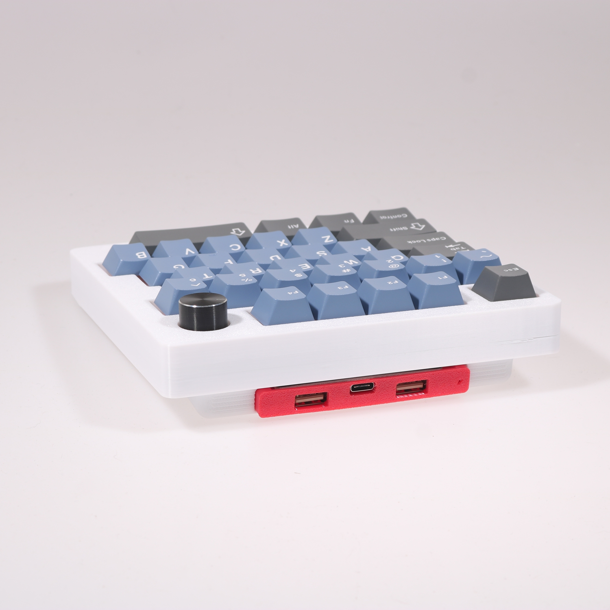
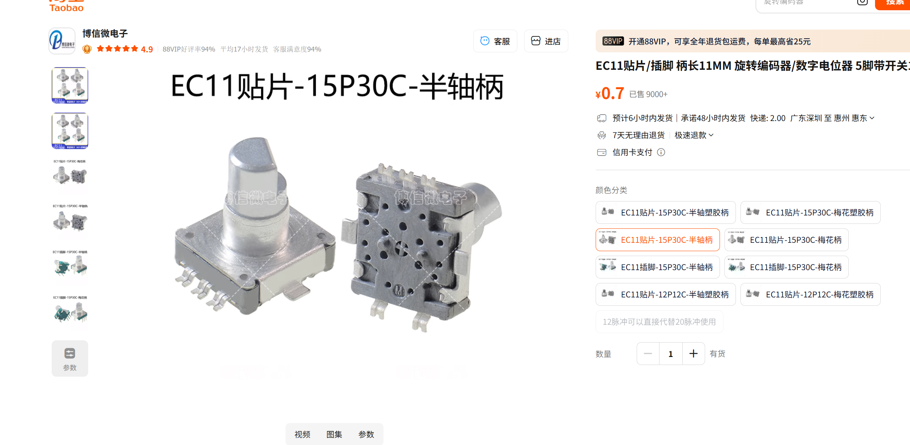

# CZMAO 08gamerst

左手游戏键盘 + 1 旋钮，STM32F103CBT6 (Blue Pill)。

两个版本：一个带两个 USB 2.0 HUB，一个不带 HUB。USB 2.0 HUB 可以插接收器使用，建议插主键盘和鼠标的接收器，然后用键盘支架把这个游戏键盘立起来。

快捷键：

| 按键            | 触发             | 备注           |
| --------------- | ---------------- | -------------- |
| FN+ALT+Lsft     | 打开/关闭 RGB    |                |
| FN+ALT+Z        | 切换灯效         |                |
| FN+ALT+S        | 饱和度+          |                |
| FN+ALT+X        | 饱和度-          |                |
| FN+ALT+D        | 颜色+            |                |
| FN+ALT+C        | 颜色-            |                |
| FN+ALT+F        | 亮度+            |                |
| FN+ALT+V        | 亮度-            |                |
| FN+ALT+G        | 灯效速度+        |                |
| FN+ALT+B        | 灯效速度-        |                |
| FN+ALT+tab      | 打开/关闭全键无冲 | 默认开启全键无冲 |
| FN+ALT+ESC      | 恢复出厂设置     |                |
| FN+ALT+Mute     | 进入 bootloader  | Mute 为旋钮位或者 F5 |

旋钮：A5 / A6，`ENCODERS_MATRIX_MAP` 映射到 row 5 的 VOLU / VOLD 两个虚拟位，因此可以在每一层（含 VIA）单独指定旋钮功能。

Keyboard Maintainer: [MAOKB](https://github.com/micahyy)
Hardware Supported: STM32F103CBT6

Make example for this keyboard (after setting up your build environment):

    make czmao/08gamerst:via

See the [build environment setup](https://docs.qmk.fm/#/getting_started_build_tools) and the [make instructions](https://docs.qmk.fm/#/getting_started_make_guide) for more information.

